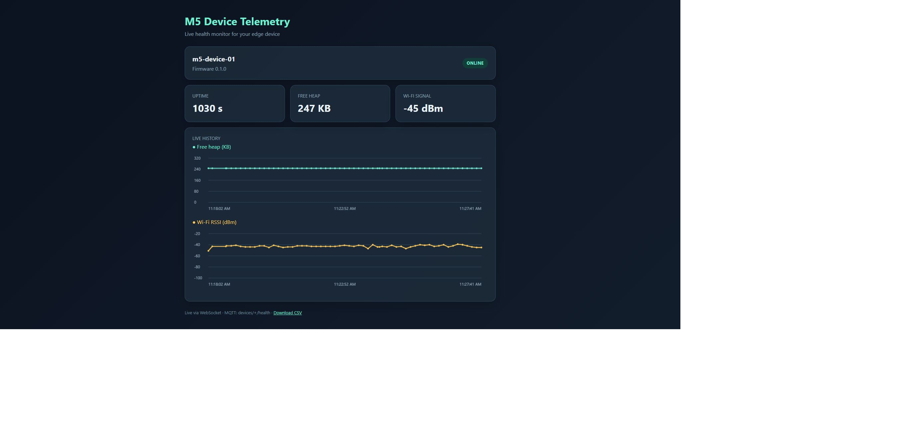

# M5 Device Telemetry

See how your M5CoreS3 is doing, live in your browser. The device sends health readings over MQTT every 10 seconds.

[Watch the video demo and code walkthrough on YouTube](https://youtu.be/G9ExVSYcjcY)



Live charts track free memory and Wi-Fi strength. The dashboard also shows uptime, detects offline devices, flags low memory or weak Wi-Fi, and saves history to SQLite with CSV export.

```text
M5CoreS3 -> Wi-Fi -> Mosquitto MQTT -> FastAPI + SQLite -> live browser dashboard
```

## Test

1. Install the Arduino `PubSubClient` library.
2. Open `m5_device_telemetry/m5_device_telemetry.ino`.
3. Enter Wi-Fi and MQTT broker details locally.
4. Upload by USB.
5. Subscribe to `devices/m5-device-01/health`.

The device publishes uptime, free heap, Wi-Fi signal strength, device ID, and firmware version every 10 seconds. Do not commit credentials.

## Dashboard

Install Python dependencies:

```powershell
python -m pip install -r requirements.txt
```

Start the dashboard while Mosquitto is running:

```powershell
python -m uvicorn dashboard:app --host 127.0.0.1 --port 8080
```

Open `http://127.0.0.1:8080` in a browser. The dashboard shows the latest health packet and marks the device offline after 30 seconds without telemetry. Recent telemetry is stored locally in `telemetry.db`, so chart history survives dashboard restarts.
